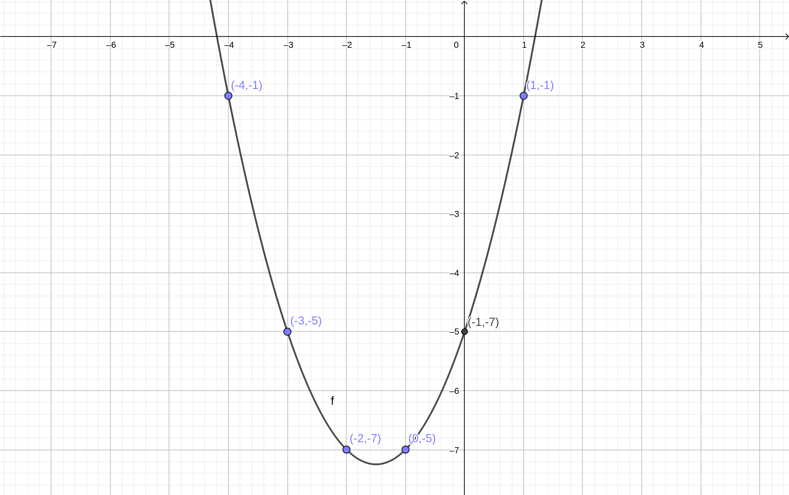
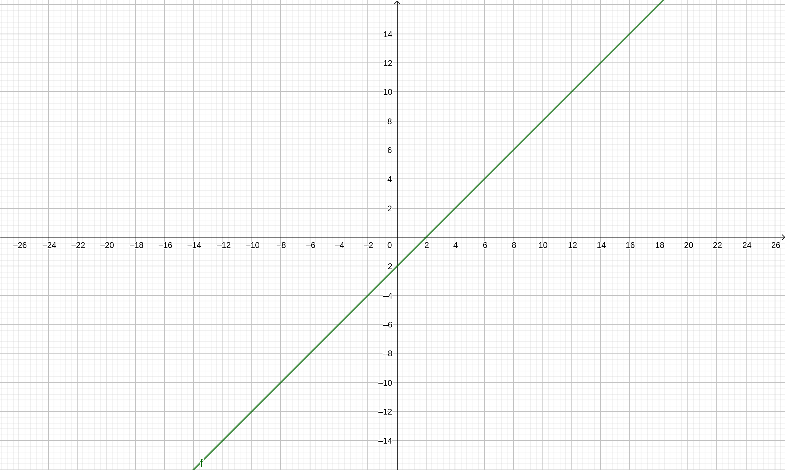
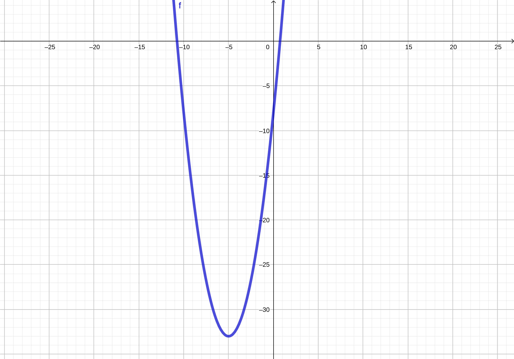
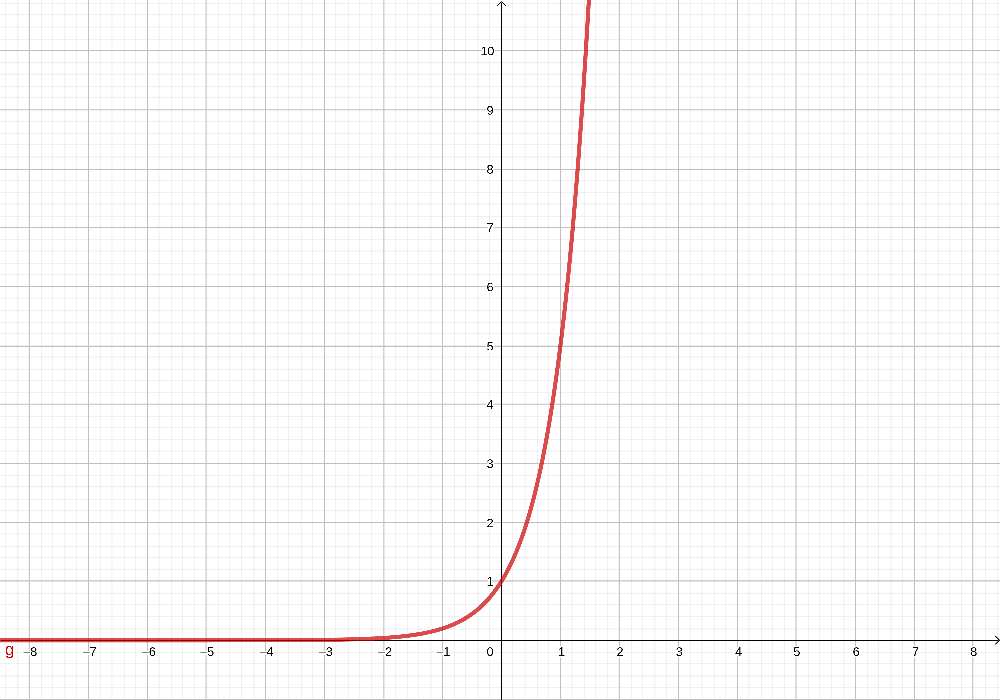
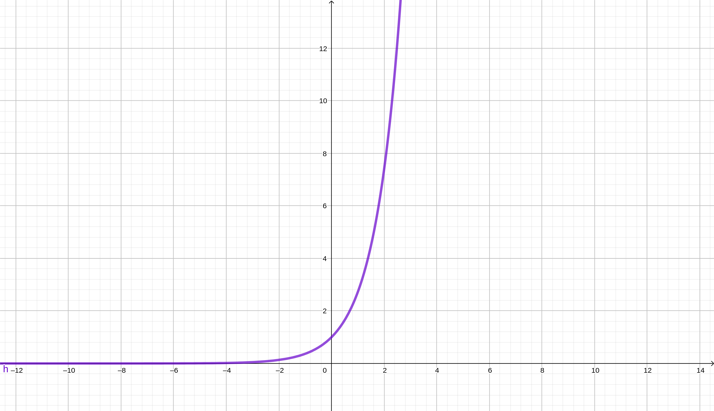
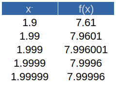
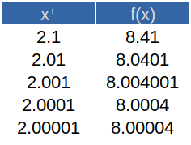
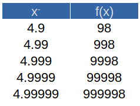
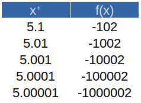

## Funciones

La aplicación de las matemáticas yace en la capacidad de identificar una representación relevante de un fenómeno del mundo real. Esta relación a menudo es conocida como un __modelo matemático__. Uno de dichos modelos, en caso de contar con un par de variables que se encuentran relacionadas entre sí, permite determinar el comportamiento de una si conocemos el de la otra. A este tipo de relaciones, si son relevantes, las conocemos como __funciones matemáticas__ o simplemente __funciones__.

### Introducción

Consideraremos una función como un dispositivo de entrada/salida. A un _dato de entrada_ se le aplica la regla matemática que lo transforma en un _dato de salida_ específico. Por ejemplo, pensemos en la expresión $y=x^2+3x-5$, la cual es la regla matemática transformadora de la función. Ahora bien, introduzcamos valores de entrada arbitrarios, los cuales los identificaremos como valores de $x$: 

$$
x=-4\\ x=-3\\ x=-2\\ x=-1\\ x=0\\ x=1
$$

Estos valores son transformados por la función, arrojando valores de salida que _dependen_ del dato de entrada introducido. Para el primer caso, el dato de salida se obtiene como:

$$
y=(-4)^2+3(-4)-5=16-12-5=-1
$$

Para el segundo valor, tenemos que:

$$
y=(-3)^2+3(-3)-5=9-9-5=-5
$$

Para el tercer dato de entrada:

$$
y=(-2)^2+3(-2)-5=4-6-5=-7
$$

Para el cuarto dato de entrada:

$$
y=(-1)^2+3(-1)-5=1-3-5=-7
$$

Para el quinto dato de entrada:

$$
y=(0)^2+3(0)-5=0-0-5=-5
$$

Para el último dato de entrada:

$$
y=(1)^2+3(1)-5=1+3-5=-1
$$

Así, tenemos que:

$$
Para\ x=-4,\ y=-1\\
Para\ x=-3,\ y=-5\\
Para\ x=-2,\ y=-7\\
Para\ x=-1,\ y=-7\\
Para\ x=0,\ y=-5\\
Para\ x=1,\ y=-1\\
$$

Como quizá recordemos, una ecuación cuadrática tiene por representación gráfica una línea curva conocida como parábola. Si la elaboramos, relacionando cada dato de entrada con su respectivo dato de salida e identificando cada par resultante, quedaría como se muestra en la siguiente figura:

Notemos pues que para cada dato de entrada le corresponde solo un dato de salida. Esto es la definición de __función__:

> Una __función__ es una regla matemática que asigna a cada valor de entrada _uno y solo un_
valor de salida.

También podemos ya definir al conjunto de todos los valores de entrada y al conjunto de todos los valores de salida como:

> El __dominio__ de una función es el conjunto de _todos los valores de entrada posibles_. El __rango__ de una función es el conjunto de _todos los valores de salida posibles_.

El proceso de asignación de valores de salida a sus correspondientes valores de entrada es conocido como __mapeo__. El mapeo de una función es válido mientras todos los valores de entrada tengan asignado un solo valor de salida. Incluso, puede darse el caso de que dos valores de entrada tengan el mismo valor de salida y el mapeo siga siendo válido. Lo que invalida el mapeo es cuando un dato de entrada tenga asignado más de dos valores de salida.

### Funciones continuas

Existe una buena cantidad de funciones que podemos considerar continuas. Esto se refiere a funciones que no dejan de existir, o que desde un punto de vista geométrico, pueden ser representadas por una línea ininterrumpida, sin cortes. Un buen ejemplo sería cualquier función lineal, tal como:

$$
f(x)=x-2
$$

Si la graficamos, la función tendría la siguiente representación:

Observemos que esta gráfica muestra una línea recta continua, ininterrumpida. No importa qué valor le asignemos a la $x$, siempre existirá la función en cuestión. Podemos concluir entonces que cualquier función lineal es una __función continua__.

Ahora bien, existen funciones no lineales que también son continuas, como las cuadráticas. Un ejemplo de éstas es la siguiente expresión:

$$
f(x)=x^2+10x-8
$$

No importa qué valor le demos a la variable, una función cuadrática como la anterior siempre será continua, aunque en este caso no se represente con una línea recta, sino curva. Más precisamente, una parábola:

Veamos un tercer caso, una función exponencial. De esta función se ilustran dos tipos: una exponencial con una base numérica cualquiera y una exponencial con el _número de Euler_ como base:

$$
f(x)=5^x
$$

La gráfica resultante de esta función cualquiera es la siguiente:

Podemos notar que esta función es continua, aunque también es notorio que su valor se dispara hacia el infinito en tanto que la variable $x$ se acerca a $2$; por otro lado, mientras la variable $x$ se vuelve cada vez más negativa, la función $f(x)$ se acerca a $0$, pero sin interrumpirse.

Veamos el comportamiento de la función $f(x)=e^x$. Podemos asignarle valores a la variable $x$ y la función solo se dispara hacia el infinito en un determinado momento, tal como se observa en la gráfica:

Importante notar que las funciones vistas hasta ahora no tienen cortes. Por lo tanto, su dominio se corresponde con el conjunto de todos los números reales. Por ejemplo, el dominio de la función $f(x)=x-2$ se escribe de la siguiente manera:

$$
[-\infty, \infty]
$$

Y se lee como «el dominio de la función $f(x)$ se limita a, pero incluyendo, el infinito negativo y el infinito positivo», o bien, «el dominio de $f(x)$ va desde el infinito negativo hasta el infinito positivo».

### Funciones discontinuas

En este apartado nos concentraremos en tres funciones que, con ciertos valores de entrada se vuelven indefinidas, es decir, se _rompen_ o dejan de existir. El primer caso es la división por cero. En segundo, cualquier raíz par de cualquier número negativo, y por último, cualquier logaritmo natural con un argumento no natural.

#### División por cero

La función discontinua por excelencia, o al menos la primera que a muchos puede venirnos a la mente es precisamente la división por cero. Cuando esto ocurre, se da un absurdo matemático, es decir, es algo que no está definido. Para ilustrar este caso de función interrumpida, veamos la siguiente función:

$$
f(x)=\frac{1}{x}
$$

Vamos a afectar esta función con un dominio restringido por nosotros mismos:

$$
[-2,2]
$$

### Aplicaciones selectas de funciones

1. Se le ha contratado como vendedor de suscripciones o «cuponeras» en cierta empresa publicista, la cual le ofrece un sueldo base de $\$500.00$ y una comisión de $\$30.00$ por suscripción vendida. ¿Cuál es la función que representa su sueldo? ¿Cuál es el dominio de dicha función? Calcule su sueldo si consigue vender 10,15, 20 y 35 suscripciones.

2. Una cláusula de su contrato especifica que su sueldo base será pagado solo cuando consiga vender más de 15 cuponeras. ¿Cómo se calcula su sueldo tomando en cuenta esta restricción?

3. En una empresa del ramo metal-mecánico se considera la compra de un torno automático, con un costo de adquisición de $\$350,000.00$. El fabricante aclara que el costo operativo del mismo para cierto material es de $\$45.00$ por cada diez piezas maquinadas. ¿Cuál sería el costo del equipo si la empresa pretende elaborar 650 piezas?

4. Una empresa que fabrica un solo producto se interesa en determinar la función que expresa el costo total anual y como una función del número de unidades fabricadas $x$. Los contadores indican que los gastos fijos cada año son de $\$50 000$. También estiman que los costos de la materia prima para cada unidad producida son $\$5.50$ y los costos de trabajo por unidad son $\$1.50$ en el departamento de ensamble, $\$0.75$ en el cuarto de acabado y $\$1.25$ en el departamento de empaque y distribución.

5. Una empresa vende un solo producto en $\$65.00$ por unidad. Los costos variables por unidad son de $\$20.00$ por materiales y $\$27.50$ por trabajo. Los costos fijos anuales son $\$100,000.00$. Elabore la función de la utilidad expresada en términos de $x$, el número de unidades producidas y vendidas. ¿Cuál es la utilidad si las ventas anuales son $\$20,000.00$ unidades?

6. Cuando las organizaciones compran equipo, vehículos, construcciones y otros tipos de “activos de capital”, los contadores por lo regular asignan el costo del artículo al periodo en que se usa el artículo. Para un equipo que cuesta $\$200,000$ y que tiene una vida útil de 5 años, los contadores podrían asignar $\$40,000$ por año como un costo de posesión del camión. El costo asignado a cualquier periodo dado recibe el nombre de __depreciación__. ¿Cuál es la función que represente este caso y cuál es su dominio?

7. La función de demanda de un producto es:

$$
q=f(p)
$$
Donde _q_ es la cantidad de productos demandados y _q_ es el precio por unidad. Para un producto dado, se sabe que la demanda disminuye 50 unidades por cada peso que aumenta su precio, y que la demanda teórica es es de 1,500 unidades a precio nulo (lo cual no siempre es algo real). Primero defina la función lineal que representa la demanda.

Enseguida, considere que el ingreso total _R_ de la venta de _q_ unidades a un precio _p_ es una función de la forma:

$$
R=pq
$$
¿Cuál es la función que nos permite calcular los ingresos por ventas? ¿Cuál es el dominio de dicha función?

## Límites

Encontrar el límite de una función consiste básicamente en calcular el valor al que la función se acerca conforme la variable independiente se acerca a un valor específico. Se representa de la siguiente manera:

$$
\lim_{x\rightarrow a} f(x)=L
$$

Para comprobar su existencia, basta con calcular el límite por los dos lados y que este sea el mismo para ambos. Es decir, acercándose por la izquierda y por la derecha al valor específico de la variable. O sea, el límite existe cuando:

$$
\lim_{x\to a^+}f(x)=\lim_{x\to a^-}f(x)=L
$$

### Límite de funciones continuas

Tomando en cuenta lo anterior, podemos decir que al momento de calcular el límite de una función cuando la variable se acerca a cierto valor, y sabemos que es continua para ese valor, entonces basta con sustituirlo en la función. Por ejemplo, para el siguiente límite:

$$
\lim_{x\to 2}(x^2+4)
$$

sabemos que la función es continua en todo momento, y más especifícamente para cuando $x=2$. Por lo tanto, basta con sustituir tal valor en la función y desarrollarla. El resultado será el límite de dicha función.

$$
\lim_{x\to 2}(x^2+4)=[(2)^2+4]=8
$$

Comprobemos la existencia de dicho límite. Para ello tomamos valores cada vez más cercanos a $2$ para $x$, acercándonos desde la izquierda y tabulando:

y tabulamos desde la derecha:

Como podemos apreciar, aunque en realidad no se llega a tocar exactamente el valor límite ($8$), nos acercamos bastante al mismo, por ambos lados. Por lo tanto, podemos asegurar que el límite sí existe para esta función y es igual a $8$.

### Límite de funciones discontinuas

En este caso debemos recordar el hecho de que las funciones discontinuas lo son en momentos específicos y no necesariamente todo el tiempo. Por ejemplo, las funciones que implican divisiones pueden volverse indefinidas solo cuando la variable haga que el denominador se vuelva nulo. Por esta razón, la recomendación implica más bien sustituir siempre el valor al que tienda la variable. Si esta sustitución deja la función indefinida, consideremos otro método: la tabulación, ya abordada con anterioridad.

Tomemos como ejemplo la obtención del siguiente límite:

$$
\lim_{x \to 3} \frac{5}{x+6}
$$
En este caso, sabemos que la función es discontinua en algún momento. Pero _no_ lo es para el valor al que tiende nuestra variable $x$. Por lo tanto podemos sustituir tranquilamente:

$$
\lim_{x \to 3} \frac{5}{x+6}=\frac{5}{(3)+6}=\frac{5}{9}
$$

El asunto cambia cuando la función se vuelve discontinua exactamente con el valor al que tienda $x$. Por ejemplo, el siguiente caso:

$$
\lim_{x \to 5} \frac{2x}{5-x}
$$

Aquí notamos que al sustituir el $5$ se da la discontinuidad para la función:

$$
\lim_{x \to 5} \frac{2x}{5-x}=\frac{2(5)}{5-(5)}=\frac{10}{0}=indefinido
$$

Un límite no puede ser _indefinido_. Debemos especificar el valor al que tiende la variable, obligatoriamente. Para ello, hacemos uso de la tabulación con valores cada más cercanos a $5$ y posteriormente comprobamos el límite como tal. Lo anterior implica obtener el límite tanto por la izquierda:

 como por la derecha:
 
 

Vemos que sin importar por cual lado nos acerquemos, no obtenemos el mismo resultado. Sin embargo, el comportamiento es el mismo para la función, su valor se dispara hacia el infinito (por ambos lados y hacia ambos lados) conforme nos acercamos cada vez más al $5$. Por lo tanto, concluimos que:

$$
\lim_{x \to 5} \frac{2x}{5-x}=\infty
$$

Podemos resolver algunos límites utilizando algún artificio matemático, como el desarrollo algebraico de las expresiones, su simplificación o factorización. Veamos un ejemplo. Calculemos el siguiente límite:

$$
\lim_{x \to -4} \frac{x+4}{x^2-16}
$$

Si simplemente sustituímos notaremos que el límite es indefinido:

$$
\lim_{x \to -4} \frac{x+4}{x^2-16}=\frac{(-4)+4}{(-4)^2-16}= \\ \frac{0}{16-16}=\frac{0}{0}=indefinido
$$
Antes de pensar en tabular, notemos que existe una especie de relación entre el denominador y el numerador, además de que el primero es factorizable. Recordemos por álgebra que:

$$
x^2-16=(x-4)(x+4)
$$

Esto es una diferencia de cuadrados. Y nos permite simplificar la expresión con el numerador:

$$
\frac{x+4} {x^2-16} = \frac{x+4} {(x-4)(x+4)} = \frac{1} {x-4}
$$

Así, ya podemos sustituir el valor:

$$
\lim_{x \to -4} \frac{1} {x-4}= \frac{1}{(-4)-4} = \frac{1}{-8}=-\frac{1}{8}
$$

