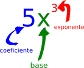

## Introducción

En esta unidad abordaremos el Cálculo Diferencial desde un enfoque minimalista, que no superficial. La intención es abordar los fundamentos del tema primero, para sentar las bases que permitan entrar al Cálculo Integral. Recordemos que las aplicaciones como tales, serán estudiadas en la última unidad del curso. Sin más preámbulo, pasemos a las reglas de derivación.

## Reglas de la derivada

La derivada de una función la podemos definir de manera burda como la razón de cambio que puede tener una función. Este simple enunciado nos permite entender la primera y más básica regla del Cálculo Diferencial. La razón de cambio de una función constante es cero. Es decir, dicha función no va a cambiar en ningún momento. 

Ahora bien, usaremos una nomenclatura sencilla para saber distinguir muy bien cuándo hablamos de una función y cuándo de la derivada de dicha función. A partir de ahora, la derivada de una función será expresada con la misma letra de ésta, pero con un acento agregado. Por ejemplo, si nuestra función es $f$, su derivada la escribiremos como $f'$.

### Regla 1: Derivada de una constante

La derivada de una constante, o sea, un número, siempre será igual a cero.

> Si $f(x)=k$, siendo $k$ una constante;
entonces $f'(x)=0$

#### Ejemplos

1. $f(x)=5$

- R: $f'(x)=0$

2. $f(x)=-21$

- R: $f'(x)=0$

### Regla 2: Derivada de una variable lineal

Antes de comenzar a hablar de esta regla, es necesario recordar un poco sobre álgebra. Es importante que distingamos entre base, exponente y coeficiente. La siguiente imagen muestra quién es quien: 

Ya que sabemos quién es el exponente y el coeficiente, podemos continuar. La derivada de una variable, cuya potencia (o exponente) es igual a uno, siempre será igual al coeficiente que acompaña a dicha variable. 

> Si $f(x)=kx$, siendo $k$ una constante; entonces $f'(x)=k$

#### Ejemplos

3. $f(x)=5x$

- R: $f'(x)=5$

4. $f(x)=-34x$

- R: $f'(x)=-34$

### Regla 3. Derivada de una variable no lineal

La derivada de una variable, cuya potencia (o exponente) no es uno, será igual al coeficiente que acompaña a dicha variable multiplicado por el exponente. A este último le restaremos un uno entero, y así tendremos el nuevo exponente.

> Si $f(x)=kx^n$, siendo $k$ una constante y $n\neq 1$; entonces $f'(x)=nkx^{n-1}$. 

#### Ejemplos

5. $f(x)=2x^4$

- R: $f'(x)=(4)2x^{4-1}=8x^3$

6. $f(x)=-3x^6$

- R: $f'(x)=(6)(-3)x^{6-1}=-18x^5$

#### Un caso especial. Regla 3a: derivada de un denominador monomio

No es exactamente un caso especial, pero es bastante frecuente. En ocasiones nos vamos a encontrar con expresiones del tipo fracción, en la cual el denominador consiste de un solo término, teniendo la forma $\frac{a}{kx^n}$. Si este es el caso, se resuelve siguiendo la misma lógica que la anterior, salvo dos diferencias:

> Si $f(x)=\frac{a}{kx^n}$, siendo $a$ y $k$ constantes no necesariamente iguales; entonces $f'(x)=\frac{(-n)a}{kx^{n+1}}$.

#### Ejemplos

7. 

$$f(x)=\frac{8}{3x}$$

- R: 

$$f'(x)=\frac{(-1)8}{3x^{1+1}}=\frac{-8}{3x^2}=-\frac{8}{3x^2}$$

En este ejemplo podemos notar que el denominador $3x$ tiene una potencia de uno, pero no podemos aplicar directamente la regla 2. Por lo tanto, consideramos el exponente ($n=1$) y aplicamos la regla 3a.

8. 

$$f(x)=\frac{-5}{4x^3}$$

- R: En este caso $n=3$, por lo tanto $-n=-3$ 

$$f'(x)=\frac{(-3)(-5)}{4x^{3+1}}=\frac{15}{4x^4}$$

### Regla 4: Derivada de varios términos

Muchas funciones no son de un solo término, por el contrario, consisten de la suma o diferencia de varios de ellos. Su derivada se obtiene derivando cada uno de los términos por separado, mediante las reglas básicas ya vistas.

> Si $f(x)=u+v$, siendo $u$ y $v$ dos funciones también; entonces $f'(x)=u'+v'$.

#### Ejemplos

9. $f(x)=3x^2+2x$

- R: $f'(x)=(2)3x^{2-1}+2=6x+2$

En este ejemplo utilizamos la regla 3 y la regla 2, respectivamente.

10. $f(x)=5x^7+4x-3x^{-2}+\frac{2}{3x^4}$

Deberíamos poder distinguir que se deben utilizar la regla 3, la regla 2, de nuevo la 3 y la extensión 3a, en orden de aparición. Por lo tanto, la solución es:

- R:

$$
f'(x)=(7)5x^{4-1}+4-(-2)3x^{-2-1}+\frac{(-4)2}{3x^{4+1}}\\
f'(x)=35x^3+4+6x^{-1}-\frac{8}{3x^5}
$$

### Regla 5: Derivada de un producto (introducción)

En el caso de tener que derivar una expresión formada por el producto de dos términos irreductibles (es decir, que no se puedan simplificar), se utiliza la regla 5. Antes de entrar de lleno con esta regla, veamos unos ejemplos que sí pueden reducirse, para distinguir cuándo sí usar la regla 5 y cuándo no.

11. $f(x)=(5x)(2x^8)$

La multiplicación de estos dos términos sí puede realizarse con mera álgebra, así que reduzcamos primero:

- R: $f(x)=(5)(2)x^{1+8}=10x^9$

 y derivemos enseguida:
 
 $f'(x)=(9)10x^{9-1}=90x^8$
 
12. $f(x)=(2x+1)(3x^2-4)$

Desarrollemos el producto de este par de binomios, recordando que se multiplica cada término del primer binomio por los dos del otro:

- R: 
  $$
f(x)=(2)(3)x^{1+2}+(2)(-4)x+(1)(3)x^2+(1)(-4)\\
f(x)=6x^3-8x+3x^2-4\\
f(x)=6x^3+3x^2-8x-4
  $$
  
  Ahora ya podemos calcular la derivada mediante la regla 4:
  
  $$
  f'(x)=(3)6x^{3-1}+(2)3x^{2-1}-8\\
  f'(x)=18x^2+6x-8
  $$

Sí existe una amplia variedad de productos irreductibles que involucran ciertas funciones, tales como el _número de Euler_ en productos como por ejemplo $(x)(e^{3x})$, pero tenemos el inconveniente de que aún no abordamos las reglas que nos permiten derivar dicha función. Por lo tanto, dejemos de lado la Regla 5 para después, cuando ya dispongamos de mejores herramientas para su desarrollo óptimo.

### Regla 6: Derivada de un cociente

Ahora trabajaremos con funciones que tienen la forma de fracción, es decir, son cocientes. Para ello, debemos asegurarnos que sean cocientes irreductibles. Esto es más sencillo, fijemos que para no ser irreductibles deben tener solo un monomio como denominador (sí, pueden reducirse fracciones cuyo denominador no sea necesariamente un monomio, pero aquí queremos hacer las cosas más fáciles o al menos más rápidas). Veamos un caso:

$$
f(x)=\frac{2x^2+3x}{x}
$$

Esta función es una fracción que puede simplificarse mediante su denominador. Por lo tanto, no es candidata a ser derivada mediante regla 6. Así, es mejor separarla y enseguida derivarla. Veamos cómo:

13. 

  $$
  f(x)=\frac{2x^2+3x}{x}=\frac{2x^2}{x}+\frac{3x}{x}
  $$
  
  Al tener un monomio como denominador, simplemente separamos la fracción en tantas como términos tenga la suma (que forma al )o resta) del numerador. Mediante álgebra simplificamos las fracciones resultantes y ya podemos derivar con las reglas vistas anteriormente:
  
  $$
  f(x)=\frac{2x^2}{x}+\frac{3x}{x}=2x^{2-1}+3x^{1-1}=2x+3
  $$
  
  Este ejemplo nos debe recordar dos cosas: que en las divisiones, los exponentes se restan y que un exponente igual a 0 implica que la base se convierta automáticamente en 1.
  
  Así, ya podemos derivar nuestra función ya simplificada:
  
  $$
  f'(x)=2
  $$

Después de este breve repaso ya podemos introducir la regla 6, para lo cual sí tenemos las herramientas básicas. La regla 6 se puede escribir así:

> Si $f(x)=\frac{u}{v}$ y $\frac{u}{v}$ no puede simplificarse, entonces $$f'(x)=\frac{u'v-uv'}{v^2}$$

#### Ejemplos

14. 

  $$
  f(x)=\frac{2x^3-4x^2}{x+3}
  $$
  
  Vemos que esta fracción no puede reducirse como lo hicimos en el ejemplo anterior, por lo tanto aplicaremos la regla 6:
  
- R: Primero definiremos $u$, $v$, $u'$ y $v'$:

  $$
  u=2x^3-4x^2\\
  v=x+3\\
  u'=(3)2x^{3-1}-(2)4x^{2-1}=6x^2-8x\\
  v'=1\\
  v^2=(x+3)^2=(x)^2+2(x)(3)+(3)^2=x^2+6x+9
  $$
  
  Ahora sustituimos estos valores en la fórmula de la regla 6:
  
  $$
  f'(x)=\frac{u'v-uv'}{v^2}=\frac{(6x^2-8x)(x+3)-(2x^3-4x^2)(1)}{x^2+6x+9}
  $$
  
  Desarrollamos el cociente:
  
  $$
  f'(x)=\frac{6x^{2+1}+(6)(3)x^2-8x^{1+1}-8(3)-[2x^3-4x^2]}{x^2+6x+9}\\
  f'(x)=\frac{6x^3+18x^2-8x^2-16-2x^3+4x^2}{x^2+6x+9}\\
  $$

  Simplificamos términos semejantes del numerador:
  
  $$
  f'(x)=\frac{6x^3-2x^3+18x^2-8x^2+4x^2-16}{x^2+6x+9}\\
  f'(x)=\frac{4x^3+14x^2-16}{x^2+6x+9}
  $$

Y ya hemos terminado. No es un procedimiento rápido, pero sí es relativamente fácil si comprendemos el mecanismo detrás.

### Regla 7: Derivada de una función elevada a una potencia

En ocasiones nos vamos a encontrar con funciones que se encuentran elevadas a una potencia, ya sea entera como las de siempre ($(4x^5-2x^2)^7$) o fraccionaria como las raíces ($\sqrt{3x+5}$). Su regla de derivación es sencilla, pero se presta a ciertas confusiones. Veámosla:

> Si $f(x)=u^n$, siendo $u$ una función multitérminos, entonces $f'(x)=(nu')u^{n-1}$.

Notemos que se trata de obtener la derivada de la función, multiplicar esta por el exponente y luego por la función original pero elevada a la misma potencia menos 1. Quizá haya sonado como trabalenguas y sea mejor ver un ejemplo.

#### Ejemplo

15. $f(x)=(2x^3-3x)^3$

  Sabemos que el exponente $n=3$, y que la derivada $u'=(3)2x^{3-1}-3=6x^2-3$. Por lo tanto, le damos la forma adecuada a nuestro ejercicio:
  
  $$
  f'(x)=(nu')u^n=[(3)(6x^2-3)](2x^3-3x)^{3-1}\\
  f'(x)=(18x^2-9)(2x^3-3x)^2
  $$

### Regla 8: Derivada del logaritmo natural

El logaritmo natural, escrito $ln(u)$ es una función bastante común en aplicaciones económicas. Sin embargo, su derivada es bastante sencilla aunque como en todo, puede llegar a complicarse dependiendo de la función a derivar. El logaritmo natural contiene siempre un argumento, que usualmente se representa dentro de paréntesis, eso es lo que se va a derivar. Podemos enunciar la derivada del logaritmo natural como sigue:

> Si $f(x)=ln(u)$, entonces 

$$f'(x)=\frac{u'}{u}$$

#### Ejemplo

16. $f(x)=ln(5x^2+3x)$

- R: En este caso, el argumento $u=5x^2+3x$ debe ser derivado:

  $$u'=(2)5x^{2-1}+3=10x+3$$
  Por lo tanto, la derivada del logaritmo queda así:
  
  $$
  f'(x)=\frac{10x+3}{5x^2+3x}
  $$

### Regla 9: Derivada del número de Euler

El logaritmo natural y el número de Euler $e$ tienen una relación muy estrecha. A grandes rasgos podríamos decir que uno es el contrario del otro, ya que si se aplican al mismo tiempo en una función se cancelan entre sí. Eso explica su importancia en aplicaciones de negocios. La derivada de funciones que incluyen a $e$ es relativamente fácil. Se enfoca solo en el exponente, derivándolo y multiplicando dicha derivada por la función original:

> Si $f(x)=ke^u$, siendo $k$ una constante, entonces $f'(x)=(u')ke^u$.

#### Ejemplo

17. $f(x)=6e^{4x^2}$

- R: En este caso, el exponente $u=4x^2$, por lo tanto $u'=(2)4x^{2-1}=8x$

  Así, la derivada es:
  
  $$
  f'(x)=(u')ke^u=(8x)6e^{4x²}\\
  f'(x)=48xe^{4x^2}
  $$

### Regla de la Cadena

Esta regla se utiliza cuando tenemos dos funciones encadenadas, es decir, una es función de la otra. Por ejemplo, si $y=f(u)$ y $u=g(x)$ y ambas son derivables, entonces: 

$$
\frac{dy}{dx}=\frac{dy}{du} \cdot \frac{du}{dx}
$$

#### Ejemplos

Supongamos el siguiente par de funciones compuestas, donde $y$ está en función de $u$ y esta se encuentra en función de $x$:

$$
y=f(u)=5u^2-20u \\
u=g(x)=6x^3+8x^2
$$

Derivamos ambas funciones, primero $y$ con respecto a $u$:

$$
y'=(2)5u^{2-1}-20u^{1-1} \\
y'=10u-20
$$

y ahora $u$ con respecto a $x$:

$$
u'=(3)6x^{3-1}+(2)8x^{2-1} \\
u'=18x^2+16x
$$

Como paso final, multiplicamos ambas derivadas:

$$
(y')(u')=(10u-20)(18x^2+16x)
$$

En este momento es importante notar que la multiplicación tiene que realizarse con respecto a la misma variable. En este caso, la que no está «encadenada», o dicho de otro modo, la que no se repite. La $u$ es la variable encadenada, por lo tanto, debemos cambiarla por lo que vale dicha variable originalmente. 

Sustituimos pues, todas las $u$ que encontremos por el valor original de la función $u$, es decir, $g(x)=6x^3+8x^2$:

$$
(y')(u')=(10u-20)(18x^2+16x) \\
(y')(u')=(10(6x^3+8x^2)-20)(18x^2+16x)
$$

En la segunda línea ya cambiamos la $u$ por su valor original. Podemos desarrollar la multiplicación indicada en la sustitución:

$$
(y')(u')=((10)6x^3+(10)8x^2-20)(18x^2+16x)\\
(y')(u')=(60x^3+80x^2-20)(18x^2+16x)\\
$$

Ahora sí, ya podemos desarrollar la expresión:

$$
(y')(u')=\\(60)18x^{3+2}+(60)16x^{3+1}+(80)18x^{2+2}+(80)16x^{2+1}-(20)18x^2-(20)16x\\
1080x^5+960x^4+1440x^4+1280x^3-360x^2-320x
$$

