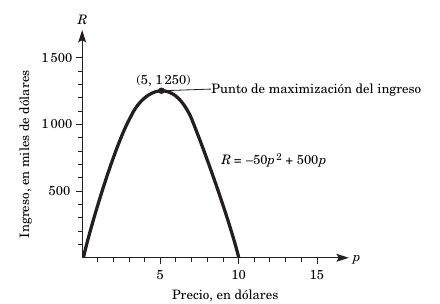

## Aplicaciones al ingreso

Nos vamos a centrar en la maximización de los ingresos para una empresa u organización. Recordemos que el dinero que entra a una organización por la venta de productos o la prestación de servicios recibe el nombre de _ingreso_. Y la manera fundamental de calcular el ingreso total conseguido con la venta de un producto (o servicio) es:

$$
\text {Ingreso total} = \text {(precio unitario)(cantidad vendida)}
$$

En esta expresión se supone que el precio de venta es igual para todas las unidades vendidas. Cabe mencionar que la manera en la que se obtiene esta expresión es bastante obvia. Nuestros ingresos por ventas dependen de cuántas unidades vendamos y su precio. Veamos algún ejemplo:

### Ejemplo

La demanda del producto de una compañía varía según el precio que le fije al producto. La compañía ha descubierto mediante un estudio (cuyo contenido y naturaleza se escapa a este ejemplo), que el ingreso total anual $R$ (expresado en miles de dólares) es una función del precio $p$ (en dólares). En concreto,

$$
R = f(p) = -50p^2 + 500p
$$

a. Determine el precio que debería cobrarse con objeto de maximizar el ingreso total.

b. ¿Cuál es el valor máximo del ingreso total anual?

#### Solución

La función de ingreso es cuadrática y su gráfica es una parábola cóncava hacia abajo, tal como la que vemos debajo. 

a. De este modo, el valor máximo de los ingresos $R$ ocurrirá en el vértice, impidiendo que el precio se dispare, ya que de hacerlo, las ventas bajarían. Para saber cuándo se alcanza el máximo, debemos seguir una serie de pasos. El procedimiento requiere que derivemos varias veces. El inicio implica calcular la primera derivada de la función de ingreso:

$$
R = f(p) = -50p^2 + 500p\\
R' = f'(p) = -100p + 500
$$

Ahora igualamos esta derivada a $0$ y la despejamos para conocer el valor de $p$:

$$
-100p+500=0\\
-100p=0-500\\
-100p=-500
$$

Podemos quitar el signo negativo, ya que ambos miembros de la expresión lo tienen. Resolvemos para $p$:

$$
-100p=-500\\
100p=500\\
p=\frac{500}{100}\\
p=5
$$

Este $5$ implica que existe un punto crítico, es decir, un momento en el que la curva de la gráfica cambia de sentido o, dicho de otra manera, la cima de la curva se encuentra en el precio $5$, lo cual puede ser comprobado con la curva. Para saber que este valor es un máximo, debemos calcular la segunda derivada de $R$:

$$
R = f(p) = -50p^2 + 500p\\
R' = f'(p) = -100p + 500\\
R''=f''(p)=-100
$$

La regla para distinguir un valor máximo de un mínimo es el signo de la segunda derivada. Si es negativo, tenemos un máximo. Si es positivo, es un mínimo. En este caso tenemos un negativo, por lo tanto un valor máximo ocurre cuando $p=5$. 

b. El valor máximo de $R$ se alcanza cuando el precio es igual a $5$. Por lo tanto, debemos sustituir este valor en la función original $R$:

$$
R_{max}=f(5)=-50(5)^2 + 500(5)\\
=-50(25)+2500=-1,250+2500\\
=1,250
$$

Esto se interpreta sabiendo que el ingreso total anual se maximiza a un valor de $\$1,250$, siempre y cuando el precio de venta sea de $\$5$.

### Ejercicio

Una compañía ha descubierto que el ingreso total es una función del precio fijado a su producto. En concreto, la función del ingreso total es 

$$
R=f(p)=-10p^2+1,750p
$$

donde $p$ es el precio en dólares.

a) Determine el precio $p$ que produce el máximo ingreso total.

b) ¿Cuál es el valor máximo del ingreso total?

